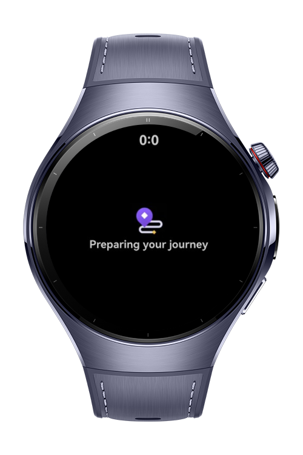

> **Note:** To access all shared projects, get information about environment setup, and view other guides, please visit [Explore-In-HMOS-Wearable Index](https://github.com/Explore-In-HMOS-Wearable/hmos-index).

# How to use localization (i18n)

Transportation App is a transportation app example. Users can view the driver and vehicle information. Additionally, they can see the start and end points of the ride, as well as the payment method.

# Preview
<div>



</div>


# Use Cases

1. Driver & Vehicle Details: Users can instantly view the assigned driver’s name, photo, and vehicle information (model, plate number, color) for safety and identification.
2. Ride Overview: Start and end locations of the trip are clearly shown, helping users track their journey.
3. Payment Transparency: Users can review the selected payment method before or during the ride to ensure smooth transactions.

# Tech Stack

- **Languages**: ArkTS
- **Frameworks**: HarmonyOS SDK 5.0.0(12)
- **Tools**: DevEco Studio Vers 5.1.0.842
- **Libraries**: @kit.ArkUI, @kit.LocalizationKit

# Directory Structure

   ```
   entry/src/main/ets/
   |---pages
   |   |---TabPage.ets             // It allows you to direct the screens to the friend where the swiper is located           
   |   |---Index.ets               // Home Page
   |---components
   |   |---FirstTab.ets            // The file containing driver and vehicle information and UI design
   |   |---PaymentTab.ets          // The file that shows the payment information, the starting and ending points of the ride and the UI design
   |   |---TimeZone.ets            // The file from which contains the time information. Since the screenshots are not taken from the actual device, the actual time data is not visible in the screenshots
   ```

# Constraints and Restrictions
## Suported Devices
- Huawei Watch 5

# License
**TransportationApp** is distributed under the terms of the MIT License
See the [LICENSE](./LICENSE) for more information.